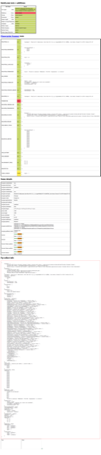
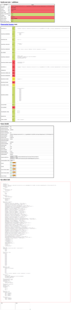
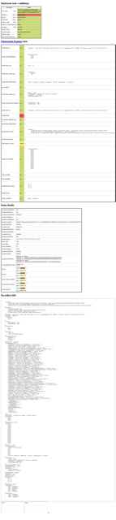
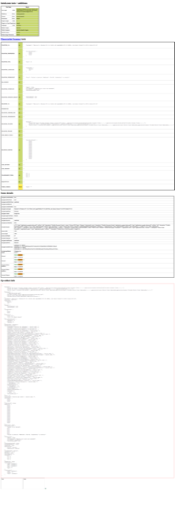
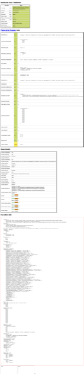
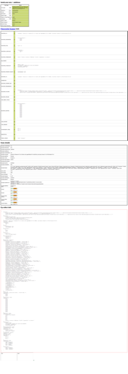
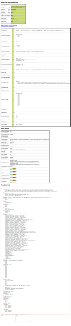

# puppeteer-extra-plugin-stealth [](https://github.com/berstend/puppeteer-extra/actions) [](http://scraping-chat.cf) [](https://www.npmjs.com/package/puppeteer-extra-plugin-stealth)

> A plugin for [puppeteer-extra](https://github.com/berstend/puppeteer-extra) to prevent detection.

<p align="center"></p>

## Install

```bash
yarn add puppeteer-extra-plugin-stealth
# - or -
npm install puppeteer-extra-plugin-stealth
```

If this is your first [puppeteer-extra](https://github.com/berstend/puppeteer-extra) plugin here's everything you need:

```bash
yarn add puppeteer puppeteer-extra puppeteer-extra-plugin-stealth
# - or -
npm install puppeteer puppeteer-extra puppeteer-extra-plugin-stealth
```

## Usage

```js
// puppeteer-extra is a drop-in replacement for puppeteer,
// it augments the installed puppeteer with plugin functionality
const puppeteer = require('puppeteer-extra')

// add stealth plugin and use defaults (all evasion techniques)
const StealthPlugin = require('puppeteer-extra-plugin-stealth')
puppeteer.use(StealthPlugin())

// puppeteer usage as normal
puppeteer.launch({ headless: true }).then(async browser => {
  console.log('Running tests..')
  const page = await browser.newPage()
  await page.goto('https://bot.sannysoft.com')
  await page.waitForTimeout(5000)
  await page.screenshot({ path: 'testresult.png', fullPage: true })
  await browser.close()
  console.log(`All done, check the screenshot. ✨`)
})
```

<details>
 <summary><strong>TypeScript usage</strong></summary><br/>

> `puppeteer-extra` and most plugins are written in TS,
> so you get perfect type support out of the box. :)

```ts
import puppeteer from 'puppeteer-extra'
import StealthPlugin from 'puppeteer-extra-plugin-stealth'

puppeteer
  .use(StealthPlugin())
  .launch({ headless: true })
  .then(async browser => {
    const page = await browser.newPage()
    await page.goto('https://bot.sannysoft.com')
    await page.waitForTimeout(5000)
    await page.screenshot({ path: 'stealth.png', fullPage: true })
    await browser.close()
  })
```

> Please check this [wiki](https://github.com/berstend/puppeteer-extra/wiki/TypeScript-usage) entry in case you have TypeScript related import issues.

</details><br>

> Please check out the [main documentation](https://github.com/berstend/puppeteer-extra/tree/master/packages/puppeteer-extra) to learn more about `puppeteer-extra` (Firefox usage, other Plugins, etc).

## Status

- ✅ **`puppeeteer-extra` with stealth passes all public bot tests.**

Please note: I consider this a friendly competition in a rather interesting cat and mouse game. If the other team (👋) wants to detect headless chromium there are still ways to do that (at least I noticed a few, which I'll tackle in future updates).

It's probably impossible to prevent all ways to detect headless chromium, but it should be possible to make it so difficult that it becomes cost-prohibitive or triggers too many false-positives to be feasible.

If something new comes up or you experience a problem, please do your homework and create a PR in a respectful way (this is Github, not reddit) or I might not be motivated to help. :)

## Changelog

> 🎁 **Note:** Until we've automated changelog updates in markdown files please follow the `#announcements` channel in our [discord server](https://discord.gg/vz7PeKk) for the latest updates and changelog info.

_Older changelog:_

#### `v2.4.7`

- New: `user-agent-override` - Used to set a stealthy UA string, language & platform. This also fixes issues with the prior method of setting the `Accept-Language` header through request interception ([#104](https://github.com/berstend/puppeteer-extra/pull/104), kudos to [@Niek](https://github.com/Niek))
- New: `navigator.vendor` - Makes it possible to optionally override navigator.vendor ([#110](https://github.com/berstend/puppeteer-extra/pull/110), thanks [@Niek](https://github.com/Niek))
- Improved: `navigator.webdriver`: Now uses ES6 Proxies to pass `instanceof` tests ([#117](https://github.com/berstend/puppeteer-extra/pull/117), thanks [@aabbccsmith](https://github.com/aabbccsmith))
- Removed: `user-agent`, `accept-language` (now obsolete)

#### `v2.4.2` / `v2.4.1`

- Improved: `iframe.contentWindow` - We now proxy the original window object and smartly redirect calls that might reveal it's true identity, as opposed to mocking it like peasants :)
- Improved: `accept-language` - More robust and it's now possible to [set a custom locale](https://github.com/berstend/puppeteer-extra/tree/master/packages/puppeteer-extra-plugin-stealth/evasions/accept-language#readme) if needed.
- ⭐️ Passes the [headless-cat-n-mouse](https://github.com/paulirish/headless-cat-n-mouse) test

#### `v2.4.0`

Let's ring the bell for round 2 in this cat and mouse fight 😄

- New: All evasions now have a specific before and after test to make make this whole topic less voodoo
- New: `media.codecs` - we spoof the presence of proprietary codecs in Chromium now
- New & improved: `iframe.contentWindow` - Found a way to fix `srcdoc` frame based detection without breaking recaptcha inline popup & other iframes (please report any issues)
- New: `accept-language` - Adds a missing `Accept-Language` header in headless (capitalized correctly, `page.setExtraHTTPHeaders` is all lowercase which can be detected)
- Improved: `chrome.runtime` - More extensive mocking of the chrome object
- ⭐️ All [fpscanner](https://antoinevastel.com/bots/) tests are now green, as well as all [intoli](https://bot.sannysoft.com) tests and the [`areyouheadless`](https://arh.antoinevastel.com/bots/areyouheadless) test

<details>
 <summary><code>v2.1.2</code></summary><br/>

- Improved: `navigator.plugins` - we fully emulate plugins/mimetypes in headless now 🎉
- New: `webgl.vendor` - is otherwise set to "Google" in headless
- New: `window.outerdimensions` - fix missing window.outerWidth/outerHeight and viewport
- Fixed: `navigator.webdriver` now returns undefined instead of false

</details>

## Test results (red is bad)

#### Vanilla puppeteer <strong>without stealth 😢</strong>

<table class="image">
<tr>

  <td><figure class="image"><a href="./stealthtests/_results/headless-chromium-vanilla.js.png"></a><figcaption>Chromium + headless</figcaption></figure></td>
  <td><figure class="image"><a href="./stealthtests/_results/headful-chromium-vanilla.js.png"></a><figcaption>Chromium + headful</figcaption></figure></td>
  <td><figure class="image"><a href="./stealthtests/_results/headless-chrome-vanilla.js.png"></a><figcaption>Chrome + headless</figcaption></figure></td>
  <td><figure class="image"><a href="./stealthtests/_results/headful-chrome-vanilla.js.png"></a><figcaption>Chrome + headful</figcaption></figure></td>

</tr>
</table>

#### Puppeteer <strong>with stealth plugin 💯</strong>

<table class="image">
<tr>

  <td><figure class="image"><a href="./stealthtests/_results/headless-chromium-stealth.js.png"></a><figcaption>Chromium + headless</figcaption></figure></td>
  <td><figure class="image"><a href="./stealthtests/_results/headful-chromium-stealth.js.png"></a><figcaption>Chromium + headful</figcaption></figure></td>
  <td><figure class="image"><a href="./stealthtests/_results/headless-chrome-stealth.js.png"></a><figcaption>Chrome + headless</figcaption></figure></td>
  <td><figure class="image"><a href="./stealthtests/_results/headful-chrome-stealth.js.png"></a><figcaption>Chrome + headful</figcaption></figure></td>

</tr>
</table>

> Note: The `MQ_SCREEN` test is broken on their page (will fail in regular Chrome as well).

Tests have been done using [this test site](https://bot.sannysoft.com/) and [these scripts](./stealthtests/).

#### Improved reCAPTCHA v3 scores

Using stealth also seems to help with maintaining a normal [reCAPTCHA v3 score](https://developers.google.com/recaptcha/docs/v3#score).

<table class="image">
<tr>

  <td><figure class="image"><figcaption><code>Regular Puppeteer</code></figcaption><br/></figure></td>
  <td><figure class="image"><figcaption><code>Stealth Puppeteer</code></figcaption><br/></figure></td>

</tr>
</table>

Note: The [official test](https://recaptcha-demo.appspot.com/recaptcha-v3-request-scores.php) is to be taken with a grain of salt, as the score is calculated individually per site and multiple other factors (past behaviour, IP address, etc). Based on anecdotal observations it still seems to work as a rough indicator.

_**Tip:** Have a look at the [recaptcha plugin](https://github.com/berstend/puppeteer-extra/tree/master/packages/puppeteer-extra-plugin-recaptcha) if you have issues with reCAPTCHAs._

## API

<!-- Generated by documentation.js. Update this documentation by updating the source code. -->

#### Table of Contents

- [class: StealthPlugin](#class-stealthplugin)
  - [Purpose](#purpose)
  - [Modularity](#modularity)
  - [Contributing](#contributing)
  - [Kudos](#kudos)
  - [.availableEvasions](#availableevasions)
  - [.enabledEvasions](#enabledevasions)
- [defaultExport(opts?)](#defaultexportopts)

### class: [StealthPlugin](https://github.com/berstend/puppeteer-extra/blob/e6133619b051febed630ada35241664eba59b9fa/packages/puppeteer-extra-plugin-stealth/index.js#L72-L162)

- `opts` **[Object](https://developer.mozilla.org/docs/Web/JavaScript/Reference/Global_Objects/Object)?** Options (optional, default `{}`)
  - `opts.enabledEvasions` **[Set](https://developer.mozilla.org/docs/Web/JavaScript/Reference/Global_Objects/Set)&lt;[string](https://developer.mozilla.org/docs/Web/JavaScript/Reference/Global_Objects/String)>?** Specify which evasions to use (by default all)

**Extends: PuppeteerExtraPlugin**

Stealth mode: Applies various techniques to make detection of headless puppeteer harder. 💯

#### Purpose

There are a couple of ways the use of puppeteer can easily be detected by a target website.
The addition of `HeadlessChrome` to the user-agent being only the most obvious one.

The goal of this plugin is to be the definite companion to puppeteer to avoid
detection, applying new techniques as they surface.

As this cat & mouse game is in it's infancy and fast-paced the plugin
is kept as flexibile as possible, to support quick testing and iterations.

#### Modularity

This plugin uses `puppeteer-extra`'s dependency system to only require
code mods for evasions that have been enabled, to keep things modular and efficient.

The `stealth` plugin is a convenience wrapper that requires multiple [evasion techniques](./evasions/)
automatically and comes with defaults. You could also bypass the main module and require
specific evasion plugins yourself, if you whish to do so (as they're standalone `puppeteer-extra` plugins):

```es6
// bypass main module and require a specific stealth plugin directly:
puppeteer.use(
  require('puppeteer-extra-plugin-stealth/evasions/console.debug')()
)
```

#### Contributing

PRs are welcome, if you want to add a new evasion technique I suggest you
look at the [template](./evasions/_template) to kickstart things.

#### Kudos

Thanks to [Evan Sangaline](https://intoli.com/blog/not-possible-to-block-chrome-headless/) and [Paul Irish](https://github.com/paulirish/headless-cat-n-mouse) for kickstarting the discussion!

---

Example:

```javascript
const puppeteer = require('puppeteer-extra')
// Enable stealth plugin with all evasions
puppeteer.use(require('puppeteer-extra-plugin-stealth')())
;(async () => {
  // Launch the browser in headless mode and set up a page.
  const browser = await puppeteer.launch({
    args: ['--no-sandbox'],
    headless: true
  })
  const page = await browser.newPage()

  // Navigate to the page that will perform the tests.
  const testUrl =
    'https://intoli.com/blog/' +
    'not-possible-to-block-chrome-headless/chrome-headless-test.html'
  await page.goto(testUrl)

  // Save a screenshot of the results.
  const screenshotPath = '/tmp/headless-test-result.png'
  await page.screenshot({ path: screenshotPath })
  console.log('have a look at the screenshot:', screenshotPath)

  await browser.close()
})()
```

---

#### .[availableEvasions](https://github.com/berstend/puppeteer-extra/blob/e6133619b051febed630ada35241664eba59b9fa/packages/puppeteer-extra-plugin-stealth/index.js#L128-L130)

Type: **[Set](https://developer.mozilla.org/docs/Web/JavaScript/Reference/Global_Objects/Set)&lt;[string](https://developer.mozilla.org/docs/Web/JavaScript/Reference/Global_Objects/String)>**

Get all available evasions.

Please look into the [evasions directory](./evasions/) for an up to date list.

Example:

```javascript
const pluginStealth = require('puppeteer-extra-plugin-stealth')()
console.log(pluginStealth.availableEvasions) // => Set { 'user-agent', 'console.debug' }
puppeteer.use(pluginStealth)
```

---

#### .[enabledEvasions](https://github.com/berstend/puppeteer-extra/blob/e6133619b051febed630ada35241664eba59b9fa/packages/puppeteer-extra-plugin-stealth/index.js#L145-L147)

Type: **[Set](https://developer.mozilla.org/docs/Web/JavaScript/Reference/Global_Objects/Set)&lt;[string](https://developer.mozilla.org/docs/Web/JavaScript/Reference/Global_Objects/String)>**

Get all enabled evasions.

Enabled evasions can be configured either through `opts` or by modifying this property.

Example:

```javascript
// Remove specific evasion from enabled ones dynamically
const pluginStealth = require('puppeteer-extra-plugin-stealth')()
pluginStealth.enabledEvasions.delete('console.debug')
puppeteer.use(pluginStealth)
```

---

### [defaultExport(opts?)](https://github.com/berstend/puppeteer-extra/blob/e6133619b051febed630ada35241664eba59b9fa/packages/puppeteer-extra-plugin-stealth/index.js#L170-L170)

- `opts` **[Object](https://developer.mozilla.org/docs/Web/JavaScript/Reference/Global_Objects/Object)?** Options
  - `opts.enabledEvasions` **[Set](https://developer.mozilla.org/docs/Web/JavaScript/Reference/Global_Objects/Set)&lt;[string](https://developer.mozilla.org/docs/Web/JavaScript/Reference/Global_Objects/String)>?** Specify which evasions to use (by default all)

Default export, PuppeteerExtraStealthPlugin

---

## License

Copyright © 2018 - 2021, [berstend̡̲̫̹̠̖͚͓̔̄̓̐̄͛̀͘](mailto:github@berstend.com?subject=[GitHub]%20PuppeteerExtra). Released under the MIT License.
